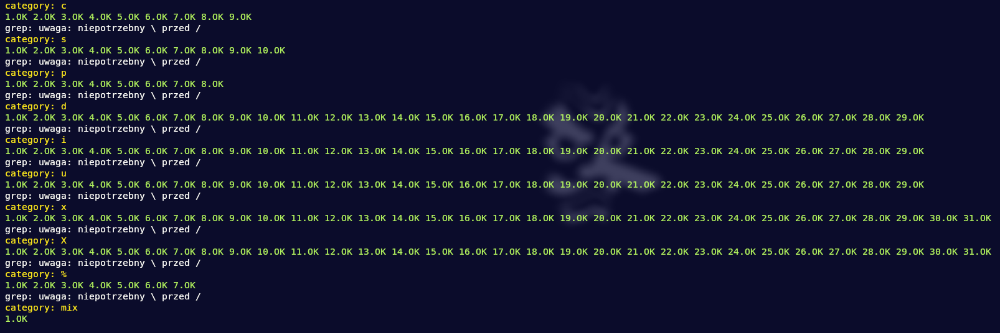

# ft_printf

This project is about recoding printf from standard C library. It is also about discovering variadic functions in C.

## Tehnologies

## Requirements

- %c Prints a single character.
- %s Prints a string (as defined by the common C convention).
- %p The void * pointer argument has to be printed in hexadecimal format.
- %d Prints a decimal (base 10) number.
- %i Prints an integer in base 10.
- %u Prints an unsigned decimal (base 10) number.
- %x Prints a number in hexadecimal (base 16) lowercase format.
- %X Prints a number in hexadecimal (base 16) uppercase format.
- %% Prints a percent sign.

## Restrictions
- You must use the command ar to create your library. Using the libtool command
is forbidden.

## Tests

Test with --strict mode

